<div align="center">

<h1>OrgoMastery: Full-Stack Learning Platform</h1>
</div>

<br />

<div align="center">
  
  
  
  
  
</div>
  
</div>

<div align="center">
  
  
  
  
  
  
</div>

---

<div align="center">
    <a href="#about">About</a> •
    <a href="#features">Features</a> •
    <a href="#visuals">Key Visuals</a> •
    <a href="#tech">Tech Stack</a> •
    <a href="#installation">Installation</a> •
    <a href="#database">Database</a> •
    <a href="#api">API</a> •
    <a href="#testing">Testing & Debugging</a> •
    <a href="#future">Future Features</a>
</div>

---

<a name="about"></a>
## 💡 About the Project

**OrgoMastery** is a full-stack educational web application designed to help students master Organic Chemistry through structured lectures, interactive quizzes, and progress tracking. The platform provides a clean, intuitive interface for learners while offering instructors powerful tools to create and manage course content.

This project combines my experience as a **college organic chemistry professor** with modern software engineering practices, demonstrating how domain expertise can be translated into scalable, user-centered applications.

---

<a name="features"></a>
## 🎯 Features

### 👨‍🎓 Student Features
- View structured lecture content (videos, notes, quizzes)
- Take interactive quizzes with instant feedback
- Track quiz performance and progress
- Participate in discussion via comments

### 👨‍🏫 Instructor Features
- Create, update, and delete lectures
- Manage lecture videos and notes
- Create quizzes and questions
- View quiz analytics and student performance

### 🔐 Authentication & Security
- JWT-based authentication
- Role-based access control:
  - STUDENT
  - INSTRUCTOR
  - ADMIN

---

<a name="visuals"></a>
## 📸 Key Visuals

### Wireframes w/Site Map

<details open>
  <summary>Click here to view wireframes.</summary>
  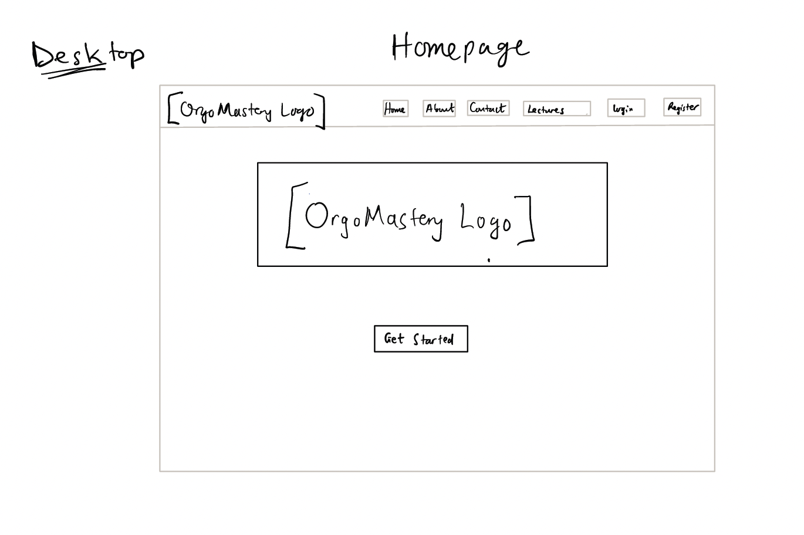
  <p><a href="preview/orgomastery-wireframes.pdf">View full PDF</a></p>
</details>

### Preview of UI

> Click on any of the items below to expand or collapse them.

#### PUBLIC SITE

<details open>
    <summary>Home, Register & Login Pages</summary>
    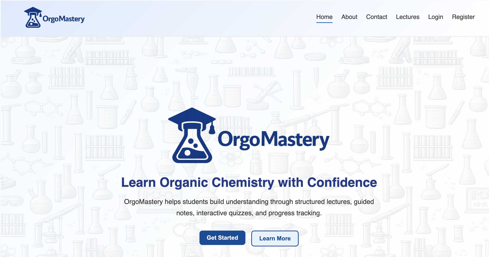
    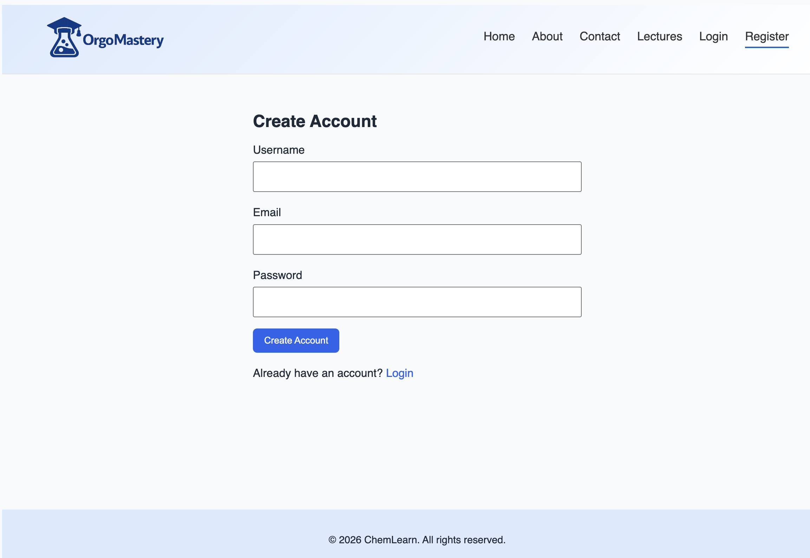
    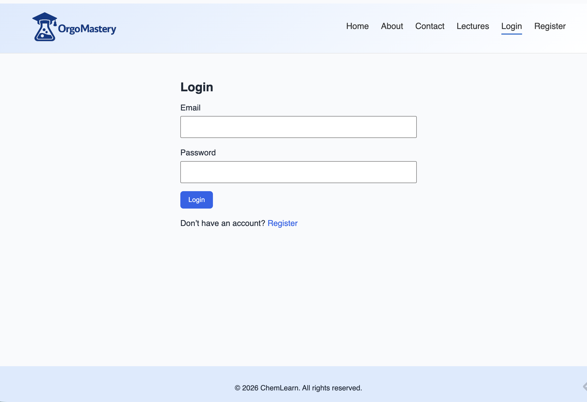
</details>

<details>
    <summary>About & Contact Pages</summary>
    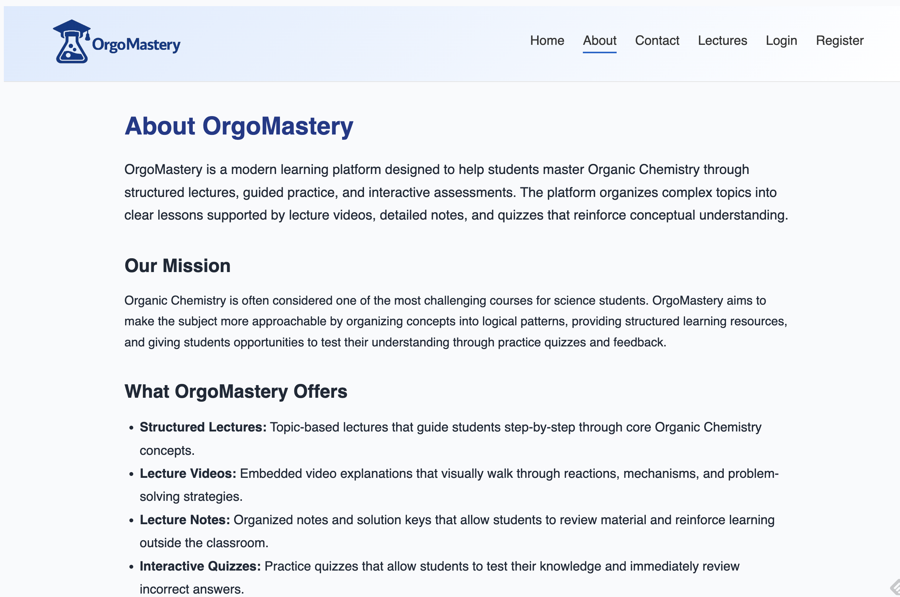
    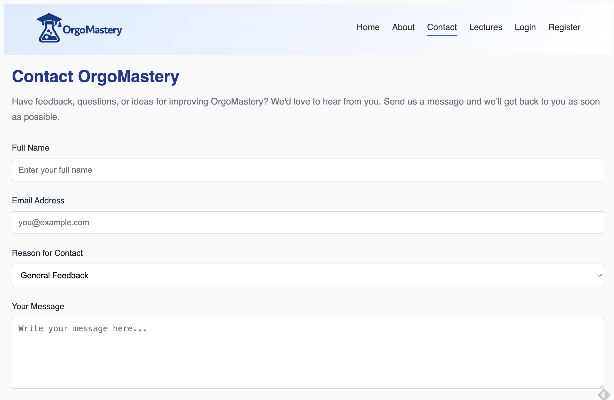
</details>

<details>
    <summary>Lecture, Videos & Notes Pages</summary>
    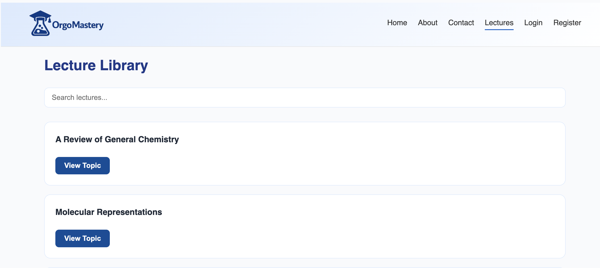
    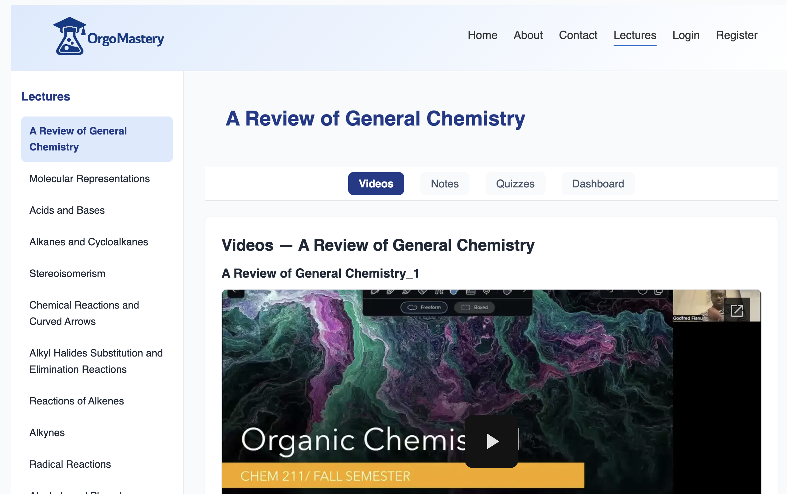  
    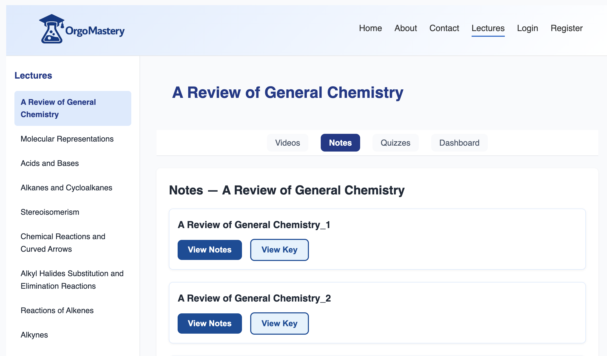
</details>

#### USER PORTAL

<details>
    <summary>Admin Dashboard</summary>
    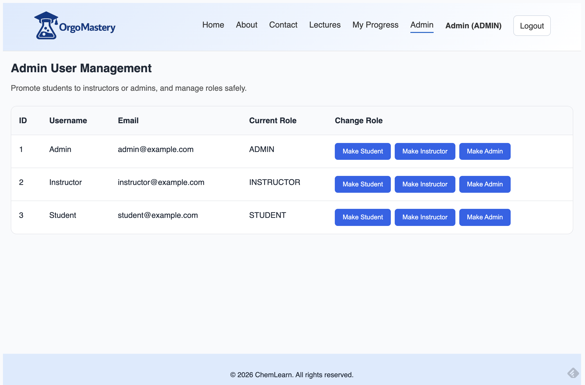
</details>
<details>
    <summary>Instructor Dashboard</summary>
    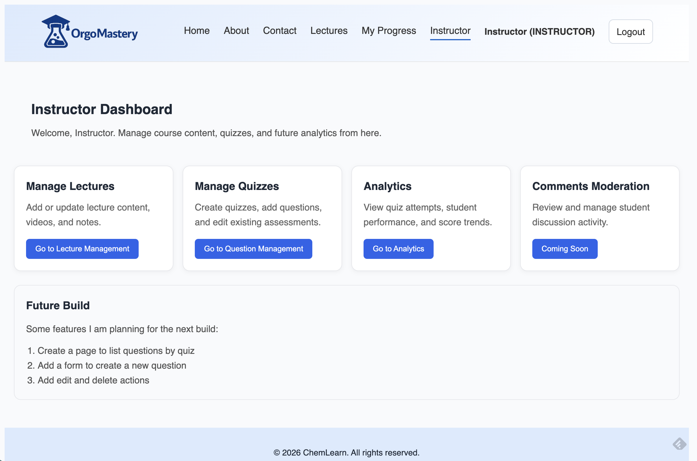
    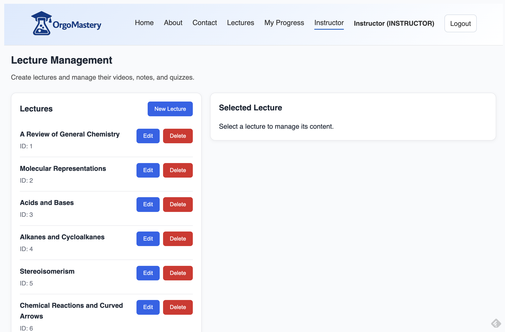
    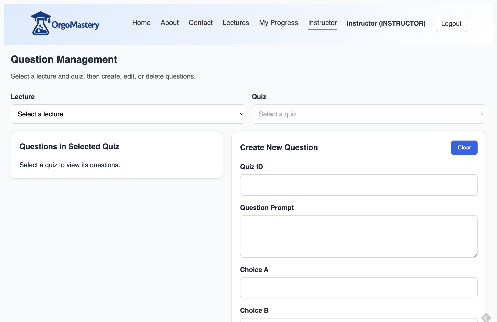
    
</details>

<details>
    <summary>Student Dashboard</summary>
    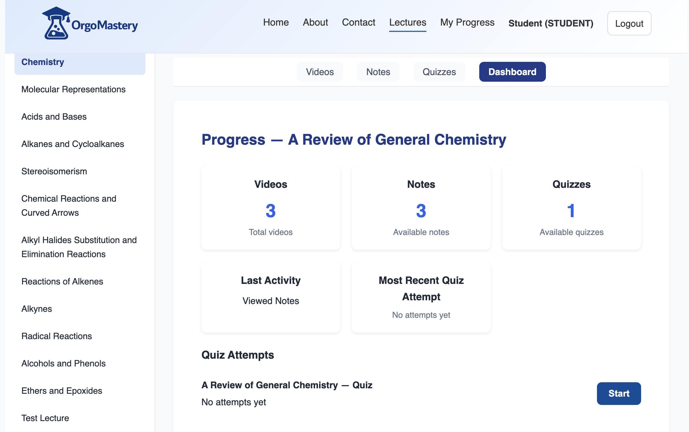
    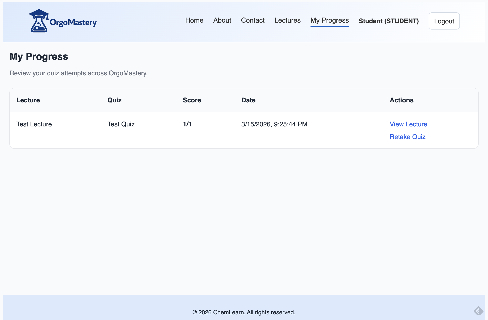
    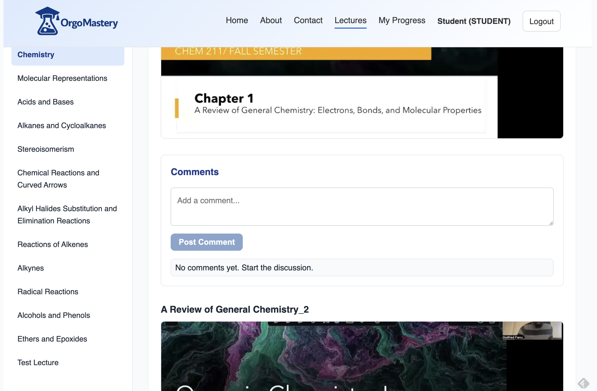
</details>

---

<a name="tech"></a>
## 🛠️ Tech Stack

This full-stack project leverages a modern, decoupled MVC architecture with multiple integrated dependencies.

### Front End

| Technology | Description |
|       ---: | :---        |
|  | Core programming language, native to all browsers for dynamic user experience |
|  | Efficient, interactive UI through component-based architecture and a virtual DOM |
|  | Declarative, component-based navigation and routing |
|  | Quick cold start and near-instantaneous Hot Module Replacement (HMR) |
|  | Styling, layout, responsiveness, and accessibility improvements |

### Back End & Database
| Technology | Description |
|       ---: | :---        |
|  | Core programming language for robust and scalable web applications |
|  | Rapid creation of standalone application with a RESTful API |
|  | Comprehensive, convention-over-configuration approach that simplifies dependency management |
|  | Object-Relational Mapping (ORM) tool for database interactions |
|  | Relational database with structured data storage |
|  | Out-of-the-box user authentication and authorization using JWT (JSON Web Tokens) |

---

<a name="installation"></a>
## 🚀 Prerequisites & Installation

> [!NOTE]
> To run this project locally, you will need the following installed:
> - Node.js (LTS version)
> - npm
> - Java Development Kit (JDK) 21
> - MySQL Server (version 8.0+)

---

### Back End Setup (Java/Spring Boot/MySQL)

1.  **Clone the repository:** In the terminal, navigate to the directory where you want the project to live, then execute the following commands:
    ```shell
    git clone https://github.com/gfianu/SWD-U2-Project_Godfred-F.git  # or your link, if forked
    cd OrgoMastery-Backend
    ```

1.  **Configure secrets for database and JWTs:** Create a new MySQL database named `orgo_mastery`, then create an `app.env` file at the project root directory (`OrgoMastery-Backend`): 
    ```properties
    # Location of your local database server
    DB_HOST=localhost
    DB_PORT=3306
    
    # Database name
    DB_NAME=orgo_mastery
    
    # Credentials
    DB_USER=orgo_mastery
    DB_PASS=[your_password]
    
    ```
    Configure `application.properties`:
     ```properties
        spring.application.name=orgomastery
        spring.config.import=optional:file:app.env[.properties]
        # Database connection settings
        spring.datasource.url=jdbc:mysql://${DB_HOST}:${DB_PORT}/${DB_NAME}?useSSL=false
        spring.datasource.username=${DB_USER}
        spring.datasource.password=${DB_PASS}
        spring.datasource.driver-class-name=com.mysql.cj.jdbc.Driver

        # Hibernate
        spring.jpa.hibernate.ddl-auto=update
        spring.jpa.show-sql=true
        spring.jpa.properties.hibernate.format_sql=true
        spring.jpa.database-platform=org.hibernate.dialect.MySQLDialect
        app.jwt.secret=your-secret-key
    ```

1.  **Run the Java/Spring Boot application:** If you do not have the application loaded in an IDE such as IntelliJ, go to the terminal and navigate to the root directory of the backend project. Then execute the following command to build and run the application (Hibernate will automatically create the tables): 
    ```shell
    mvn spring-boot:run
    ```
    
    🟢 The API should now be running on `http://localhost:8080`.
---

### Front End Setup (React/Vite)

1.  **Navigate to the front end project directory:** 
    ```shell
    cd ../OrgoMastery-Frontend
    ```

1.  **Install dependencies:** 
    ```shell
    npm install
    ```

1.  **Run the React/Vite application:** 
    ```shell
    npm run dev
    ```
    
    🟢 The frontend application will start and can be found in a browser, typically at `http://localhost:5173`.

---

<a name="database"></a>
## 🗄️ Database Structure (ERD)

The database is centered around:

1. Users (roles: STUDENT, INSTRUCTOR, ADMIN)
2. Lectures
3. Videos & Notes
4. Quizzes & Questions
5. Quiz Attempts
6. Comments
### Key Relationships:
1. Lecture → Videos, Notes, Quizzes
2. Quiz → Questions
3. User → Attempts
4. Attempt → Answers

### Entity Relationship Diagram (ERD)
<details open>
  <summary>Click here to toggle view of ERD</summary><br />
<em>Click on image to view in Lucid.</em><br />
<a href="https://lucid.app/lucidspark/0f2ea27d-fb56-46c6-98c8-5bdbf376abad/edit?page=0_0&invitationId=inv_05876567-491b-46c9-8c10-b02464b26735#">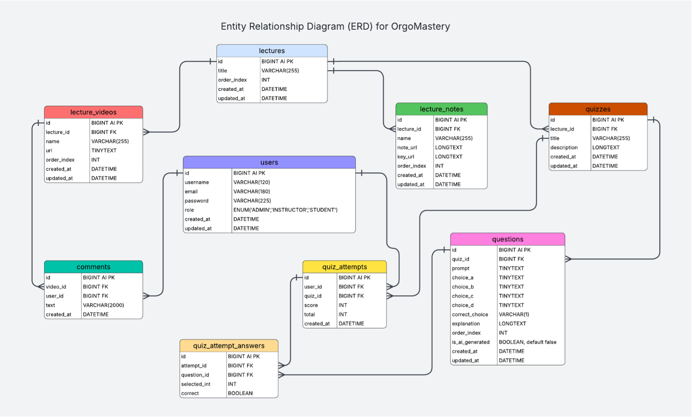</a>
</details>

---

<a name="api"></a>
## ⚙️ API Endpoints

### Authentication 🔐
| HTTP Method | Endpoint | Description |
| :--- | :--- | :--- |
| 🟡 `POST` | `/api/auth/register` | Register user |
| 🟡 `POST` | `/api/auth/login` | Login |
| 🟢 `GET` | `/api/auth/me` | Get current user |

### Lectures 👨‍🏫
| HTTP Method | Endpoint | Description |
| :--- | :--- | :--- |
| 🟢 `GET` | `/api/lectures` | Get lectures |
| 🟡 `POST` | `/api/lectures` | Create lectures |
| 🔵 `PUT` | `/api/lectures/{id}` | Update lecture by id |
| 🔴 `DELETE` | `/api/lectures/{id}` | Delete lecture by id |

### Quizzes 📝
| HTTP Method | Endpoint | Description |
| :--- | :--- | :--- |
| 🟢 `GET` | `/api/quizzes/{id}` | Get quiz by id |
| 🟡 `POST` | `/api/quizzes/{id}/attempts` | Submit quiz |
| 🟢 `GET` | `/api/quizzes/{id}/analytics` | Get quiz analytics |

---

<a name="testing"></a>
## 🧪 Testing & Debugging

Key debugging efforts included:

- Resolving **403 Forbidden errors** due to Spring Security misconfiguration
- Fixing **role-based authorization flaws**
- Debugging **frontend/backend API mismatches**
- Managing **React state updates after CRUD operations**
- Resetting and reseeding the database during schema changes
  
---

<a name="future"></a>
## 🔮 Future Features

- AI-powered question generation
- Advanced quiz analytics dashboard
- Comment moderation system
- Improved progress tracking
- Instructor-specific course ownership
- Deployment (Render / AWS / Netlify full-stack)

---

## 🧑‍💻 Designer & Author

Developed by a college organic chemistry professor transitioning into software engineering.

This project reflects the intersection of education, data modeling, and full-stack development.

Godfred Fianu - [@gfianu](https://github.com/gfianu) - [Professional Page](http://gfianu.github.io) - [LinkedIn](https://www.linkedin.com/in/godfred-fianu-phd-8479b727/)
